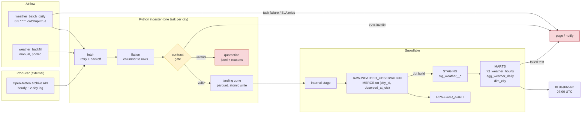
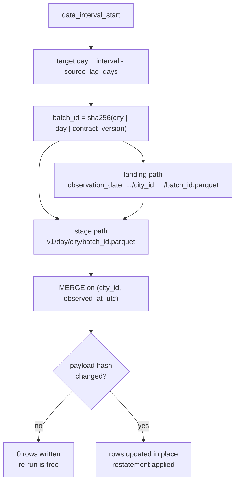

# batch-api-snowflake

[](https://github.com/JanIzmer/batch-api-snowflake/actions/workflows/ci.yml)

A daily batch pipeline that pulls hourly weather observations from a public API,
lands them as Parquet, loads them into Snowflake with an idempotent `MERGE`,
and models them with dbt into staging views and marts. Orchestrated by Airflow,
runnable end to end with `docker compose up`.

The interesting parts are not the extraction — they are the boring guarantees
around it: a data contract that the code actually enforces, re-runs that cannot
duplicate rows, a quality gate with a defined failure policy, and an incident
path that works at three in the morning.

---

## Flow



### The unit of work

Everything is built around one idea: **the unit of work is `(city, day)`.**



A day is never derived from `date.today()`, only from the Airflow interval. That
single rule is what makes `catchup=True` a correct backfill instead of a way to
load today N times, and it is why a retry, a catch-up and a manual re-run are
all the same operation.

---

## What is in here

```
contracts/          data contract YAML, versioned, read at runtime
seeds/              city catalogue CSV - read by BOTH the ingester and dbt
src/pipeline/
  api/client.py     HTTP client: typed transient/permanent errors, backoff
  contracts.py      contract loader + row validation
  models.py         columnar payload -> hourly rows, deterministic batch ids
  landing.py        atomic partitioned parquet writes
  quality.py        contract gate, quarantine, reject-ratio threshold
  warehouse/        connection, DDL, PUT + MERGE loader, load audit
  run.py            the (city, day) unit and the loop over it
  cli.py            typer CLI - Airflow calls exactly this
dbt/                staging + marts, schema tests, singular tests, exposures
airflow/dags/       daily DAG, backfill DAG, alert routing
docker/             one image for Airflow workers and the CLI
tests/              46 unit tests, no network, no warehouse
```

Full detail lives in [`docs/`](docs/):
[data contract](docs/data_contract.md) ·
[idempotency & backfill](docs/idempotency.md) ·
[failure modes](docs/failure_modes.md) ·
[runbook](docs/runbook.md) ·
[cost model](docs/cost_model.md)

---

## Quickstart

```bash
cp .env.example .env          # fill in Snowflake credentials
make up                       # Airflow at localhost:8080 (admin/admin)
make apply-ddl                # create databases, schemas, stage, tables
make ingest DATE=2026-09-08   # one day, all cities
make dbt-build                # seed + staging + marts + tests
```

No Snowflake account handy? `--land-only` runs the whole ingestion path and
writes Parquet locally:

```bash
docker compose run --rm cli weather-pipeline ingest --date 2026-09-08 --land-only
```

Unit tests need neither network nor warehouse:

```bash
make install && make test
```

---

## Data contract

[`contracts/weather_observation.v1.yml`](contracts/weather_observation.v1.yml)
is machine readable — the pipeline loads it and validates against it, so it
cannot drift from the code.

| | |
|---|---|
| **Grain** | one row per `(city_id, observed_at_utc)` |
| **Primary key** | `(city_id, observed_at_utc)` — also the MERGE key |
| **Partition key** | `observation_date` — also the unit of reprocessing |
| **Source lag** | 2 days; the pipeline never asks for anything newer |
| **Compatibility** | backward |

**When the schema changes:**

| Change | Breaking? | Response |
|---|---|---|
| New optional field | no | logged as `unknown_fields`, batch loads; add to the contract if wanted |
| New required field | yes | new contract version |
| Field removed or renamed | yes | rejects breach the 2% threshold → task fails → new version |
| Type widened (int → float) | no | accepted |
| Type narrowed | yes | new version |
| **Unit/meaning changes (°C → °F)** | **yes, and invisible** | nothing catches it automatically — see [the honest note](docs/failure_modes.md#a-unit-or-meaning-changes-silently-c--f) |

Contracts are never edited in place once data has landed under them; a breaking
change gets a `v2` file and the two versions run side by side until history is
migrated. Every row carries `_contract_version`, so "which rules produced this
number" is answerable for rows loaded years ago.

---

## Idempotency

Re-running any day, any number of times, in parallel with anything else,
converges to the same state.

| Layer | Mechanism |
|---|---|
| Scheduling | target day from `data_interval_start`, never `today()` |
| Landing | filename = deterministic `batch_id`; write-to-temp-then-rename |
| Staging | `PUT ... OVERWRITE = TRUE` to a path keyed by batch id |
| Loading | `MERGE` on the contract PK, guarded by `_source_payload_hash` |
| Shortcut | `OPS.LOAD_AUDIT` lookup skips an unchanged partition entirely |
| dbt | `incremental_strategy = 'merge'` + a 7-day **restatement window**, not `> max(date)` |

The restatement window matters more than it looks. A `> max(date)` incremental
filter freezes a day at whatever the producer had published the first time it
was seen — and the producer publishes partial days. Reprocessing the last week
costs ~1 300 rows per run and means late corrections actually land.

Backfill: trigger `weather_backfill` with a date range. It fans out into one
mapped task per `(city, day)` through a 6-slot pool and runs **one** dbt build
at the end. A full year of history is ~2 920 units, about 25 minutes and
[roughly $4](docs/cost_model.md#what-a-backfill-costs).

---

## Data quality

Checks run in two places, deliberately: **in Python on the way in** (can reject
a row before it reaches the warehouse) and **in SQL on the way out** (can see
relationships across the whole table).

| Where | Check | On failure |
|---|---|---|
| Python | required fields, types, contract ranges | row → quarantine JSONL with per-row reasons |
| Python | reject ratio > 2% of the batch | `DataQualityError`, exit code 2, nothing loaded, page |
| Python | unknown producer field | warn — early signal of an unannounced schema change |
| dbt | `unique`, `not_null` on every key | error; failing rows stored in `WEATHER.OPS` |
| dbt | `relationships` fact → `dim_city` | error |
| dbt | `accepted_range` on measurements | **warn** — a bad reading is a producer conversation, not an outage |
| dbt | `source freshness` 30 h warn / 48 h error | error, and it runs *before* `dbt run` so stale data does not cost transform credits |
| dbt | `assert_hourly_completeness` | warn — partial days self-heal via the restatement window |
| dbt | `assert_no_missing_days` | warn — this is what catches a failure nobody noticed |
| dbt | `assert_daily_matches_hourly` | error — the two marts disagreeing is a real bug |
| dbt | `assert_no_future_observations` | error — catches double timezone application |

The split between *error* and *warn* is the point. Everything that pages is
something a human must act on tonight; everything that self-heals or needs a
data owner tomorrow goes to a separate channel. Mixing them makes the page
channel worthless within a month.

---

## Failure modes

The full table with detection, blast radius and recovery is in
[`docs/failure_modes.md`](docs/failure_modes.md). The ones worth knowing before
touching this repo:

| Failure | Detected by | Automatic response | Blast radius | Human action |
|---|---|---|---|---|
| API down / timeout | `TransientApiError` | 5 client retries (backoff + jitter) → 3 Airflow retries → ~90 min tolerated | one `(city, day)` | none unless the outage outlives retries |
| API returns 4xx | `PermanentApiError` | **no retry**, fail immediately, page | usually all cities | fix the request — retrying our own bad request just delays the alert |
| Ragged series (arrays of different length) | `ValueError` in `flatten_hourly` | batch refused | one `(city, day)` | investigate — zipping anyway would shift every value onto the wrong hour, with a perfect row count |
| Empty window for a past day | `ValueError` | task fails | one `(city, day)` | an empty answer for a 2-day-old day is an anomaly, not an empty batch |
| A few rows violate the contract | `quality.check_batch` | quarantined with reasons, rest of the batch loads | those rows | review the JSONL next working day |
| >2% of rows violate it | reject-ratio threshold | nothing loads, page | one batch | the producer changed something |
| Unannounced new field | `unknown_fields` warning | ignored, batch loads | none | decide whether to adopt it |
| **Unit/meaning change (°C → °F)** | **weakly — range tests only** | none | everything | the failure mode this design is worst at; mitigation is the producer's changelog and watching distributions |
| Task killed mid-write | leftover `.tmp` file | cleaned on next run; publish is rename-atomic | none | none |
| Load fails mid-MERGE | exception | rollback + audit row with the error, then retry | one partition | retry; the MERGE is idempotent |
| Two runs load the same partition | — | second finds the hash unchanged, writes nothing | none | none — daily and backfill are meant to overlap |
| Credentials expired | connection error on every task | retries, then page | all | rotate the Variable; no re-fetch needed, Parquet is already landed |
| Load ran but loaded nothing | `dbt source freshness` | run stops before transform credits are spent | all | check `LOAD_AUDIT.status` — `skipped_unchanged` vs no rows at all |
| A `unique`/`not_null` test fails | `dbt test` | page; failing rows materialised in `WEATHER.OPS` | marts | `select * from WEATHER.OPS.<test_name>` |
| A day is missing entirely | `assert_no_missing_days` | notify | that day | backfill DAG |
| The two marts disagree | `assert_daily_matches_hourly` | page | marts | `dbt build --select fct_weather_hourly+` |
| **DAG vanishes from the scheduler** (import error) | **CI** — the DAG bag is loaded and asserted | PR fails | would be total | an `ImportError` in a DAG file fails nothing at runtime; the DAG just silently disappears |
| Nobody sees the 03:00 page | `source freshness` + `assert_no_missing_days` on a later run | — | delayed detection | the backstops work from the data, not the orchestrator, so a DAG that never started is still caught |

---

## Cost

At the current volume (8 cities × 24 h = 192 rows/day) a run costs
**≈ 0.16 credits ≈ $0.48**, about **$15/month** — and roughly **half of that is
warehouse idle time, not query time**. That fact drives most of the design:

* **two warehouses** (XS for loading, S for dbt) so tiny MERGEs do not pay
  Small-sized credits, and so the bill says which half is growing;
* **auto-suspend at 60 s / 120 s** instead of the 10-minute default, which alone
  would bill ten times the actual work;
* **no `CLUSTER BY` on RAW** — automatic clustering is a separately billed
  background service that earns its keep past a few hundred GB, not on 4 MB/year
  that already arrives in date order;
* **`cluster_by = observation_date` on the marts**, declared now while it is
  free, because every BI query and every backfill filters on it;
* **landing partitioned `observation_date` → `city_id`**, in that order, because
  reprocessing is always scoped by date first and cities are few;
* **MERGE over DELETE+INSERT** — an unchanged re-run writes zero micro-partitions;
* a **resource monitor at 50 credits/month** (~3× expected) so a runaway
  backfill is caught the same day rather than on the invoice.

Every connection sets `QUERY_TAG` to the Airflow `dag_run_id`, so any single run
is attributable in `ACCOUNT_USAGE.QUERY_HISTORY`. Workings, measurement queries
and where this design stops scaling: [`docs/cost_model.md`](docs/cost_model.md).

---

## Testing and CI

`make test` — 46 unit tests, no network and no warehouse. They cover the things
that are expensive to get wrong: retry classification, ragged payloads, contract
validation, the reject-ratio threshold, that a re-run overwrites instead of
appending, and that the MERGE keys on the contract's primary key.

CI ([`.github/workflows/ci.yml`](.github/workflows/ci.yml)) runs ruff + mypy,
pytest on 3.11 and 3.12, a contract smoke test, `dbt deps` + `dbt parse` +
sqlfluff, builds the image, and **loads the Airflow DAG bag to assert both DAGs
import** — because a DAG with an import error does not fail anything, it just
quietly stops existing.

---

## Things I would change with more time

* Move the landing zone to S3 with an external stage; the per-partition `PUT`
  becomes the bottleneck long before the MERGE does.
* Replace the `BashOperator` dbt tasks with per-model tasks so a failed model
  retries alone and lineage is visible in the Airflow graph.
* Add snapshots on `dim_city` — the catalogue is currently overwritten, so a
  city changing its coordinates rewrites history silently.
* Add an anomaly check on the *distribution* of `avg_temperature_c`, which is
  the only realistic defence against a silent unit change at the producer.
